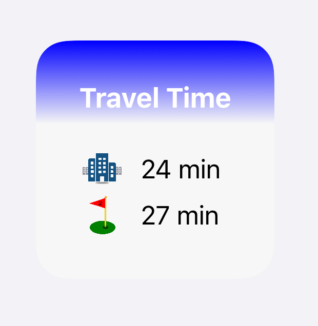

# scriptable_travel_time
Scriptable travel time widget using TomTom API

It will show travel time to multiple waypoints, ignoring waypoints within a configurable distance

set your TomTom API key, and add your latitude and longitude configuration.

App Configuration
 * {API_KEY} TomTom API key
 * {THRESHOLD} distance threshold to run calculations in miles
 * {config} waypoints configuration
 *  {lat} latitude
 *  {long} longitude
 *  {img} image name in iCloud/Scriptable/img folder
 *  {letter} alternate text if img error

